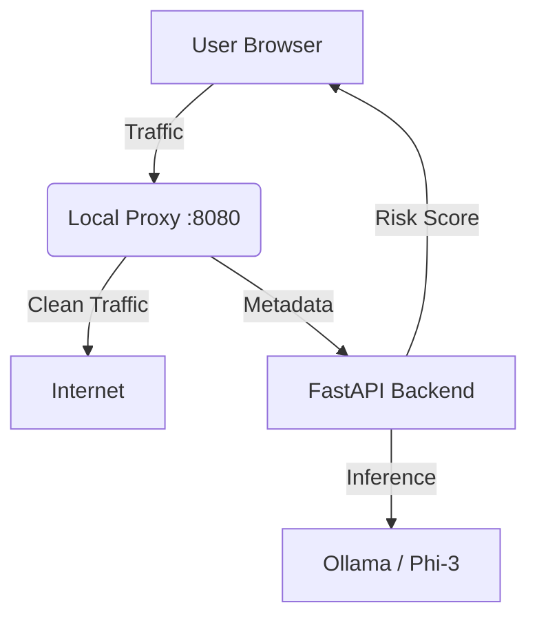

# SafeLens: Privacy Preserving Browser Agent

> **An Agentic AI that lives in your browser, detects invisible trackers, and "poisons" their data before it leaves your device.**

## Overview
SafeLens is not just an ad-blocker; it is an **Autonomous Privacy Agent**. While traditional tools simply block domains, SafeLens uses a local LLM (Phi-3) and a heuristic engine to analyze network traffic in real-time. It actively fights back against surveillance capitalism by performing **Traffic Poisoning**—injecting fake data into tracking requests to ruin the advertisers' user profiles.

**Built for the Samsung Privacy Ecosystem.**

## Key Features
* **Hybrid AI Analysis:** Combines instant heuristic scoring with on-device LLM (Phi-3) reasoning to detect zero-day privacy threats.
* **Agentic Data Poisoning:** Intercepts tracking requests (e.g., Google Ads, Taboola) and fuzzes sensitive parameters (User ID, Geolocation) with dummy data.
* **Zero-Latency UI:** Optimistic UI updates ensure the browsing experience never feels slow, even while the AI crunches data.
* **Local-First Privacy:** All analysis happens on-device. No browsing history is ever sent to a cloud server.

---

## Architecture
SafeLens operates on a 3-tier architecture:
1.  **Extension Layer (Frontend):** Collects metadata (Cookies, Scripts) and displays the Privacy Dashboard.
2.  **Analysis Layer (Backend):** FastAPI server running the Heuristic Engine + Ollama (Phi-3).
3.  **Interception Layer (Proxy):** `mitmproxy` script that sits between the browser and the internet to modify/block packets.



## Prerequisites

Before running SafeLens, ensure you have the following installed:
- Python 3.10+

- Google Chrome (or Brave/Edge)

- Ollama (for running the local AI model)<br>
https://ollama.com/

## Setup Guide
1. Clone the Repository
```bash
git clone [https://github.com/yourusername/SafeLens.git](https://github.com/yourusername/SafeLens.git)
cd SafeLens
```

2. Setup the AI Model (Ollama)
Pull the lightweight Phi-3 model. This runs efficiently even on 8GB RAM laptops.
```bash
ollama pull phi3:mini
ollama serve
```
(Keep this terminal running in the background)

3. Setup the Backend
Open a new terminal in the project root.
```bash
cd backend
python -m venv venv
# Windows
venv\Scripts\activate
# Mac/Linux
source venv/bin/activate

pip install -r requirements.txt
```

4. Configure the Browser Extension
- Open Chrome and go to chrome://extensions/.
- Enable Developer Mode (top right toggle).
- Click Load unpacked.
- Select the SafeLens/extension folder.
- Note: You will see the SafeLens shield icon appear in your toolbar.

## How to Run (The Demo Sequence)
To run the full system, you need two terminal windows running simultaneously.
 Terminal 1: The Brain (FastAPI)
```bash
cd backend
# Make sure venv is activated
uvicorn app.main:app --reload
```

You should see: Uvicorn running on http://127.0.0.1:8000

 Terminal 2: The Agent (Proxy)
```bash
cd backend/proxy
# Make sure venv is activated
mitmdump -s agent_core.py
```
You should see: HTTP(S) proxy listening at *:8080

Launch Chrome (The "Agentic" Way)
To force Chrome to route traffic through our Agent (without messing up your system-wide proxy settings), run this command in PowerShell (Windows) or Terminal (Mac):

Windows (PowerShell):

```bash
& "C:\Program Files\Google\Chrome\Application\chrome.exe" --proxy-server="127.0.0.1:8080" --ignore-certificate-errors --user-data-dir="C:\temp\safelens_profile"
```

Mac/Linux:

```bash
/Applications/Google\ Chrome.app/Contents/MacOS/Google\ Chrome --proxy-server="127.0.0.1:8080" --ignore-certificate-errors --user-data-dir="/tmp/safelens_profile"
```

## Testing the Project
- In the launched Chrome window, visit a tracker-heavy site (e.g., economictimes.indiatimes.com or skribbl.io).
- Look at the Page: You will see a small SafeLens Shield icon in the top right showing a Risk Score.
- Look at the Bottom Right: If threats are found, a "SafeLens Alert" card will pop up.
- Look at Terminal 2 (Proxy): You will see logs like:
```bash
SAFELENS AGENT INTERVENTION
Action: Poisoned Parameter 'user_id'
Old Value: 12345...
New Value: SAFELENS_POISON_9988
```

## Troubleshooting
1. "LLM Error: model requires more system memory"

Fix: We have optimized the code to use Heuristic Scoring first. Ensure you pulled phi3:mini and not the larger versions. Close other heavy apps.

2. "Connection Refused" in Browser

Fix: Ensure mitmdump is running in Terminal 2. If it is, check if the browser was launched with the --proxy-server="127.0.0.1:8080" flag correctly.

3. "Privacy Dashboard is Empty"

Fix: Refresh the webpage. The extension needs a page load event to trigger the analysis pipeline.

## License
This project is created for the Samsung PRISM hackathon 2025.
